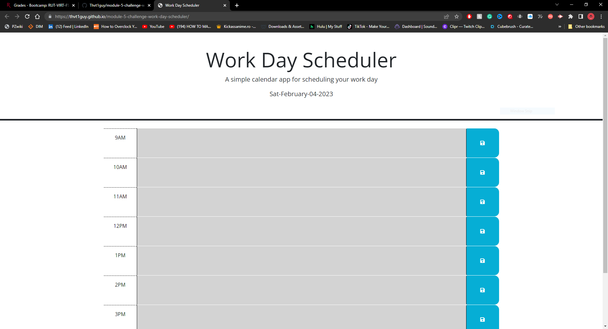
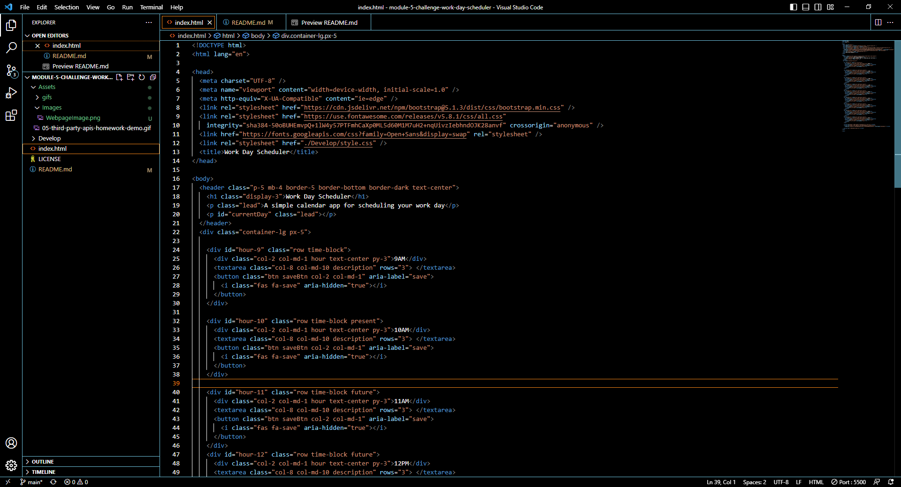
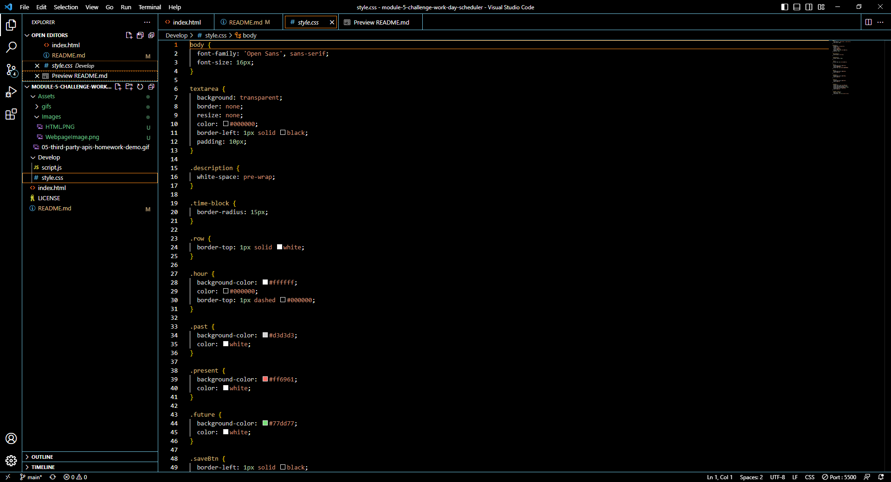
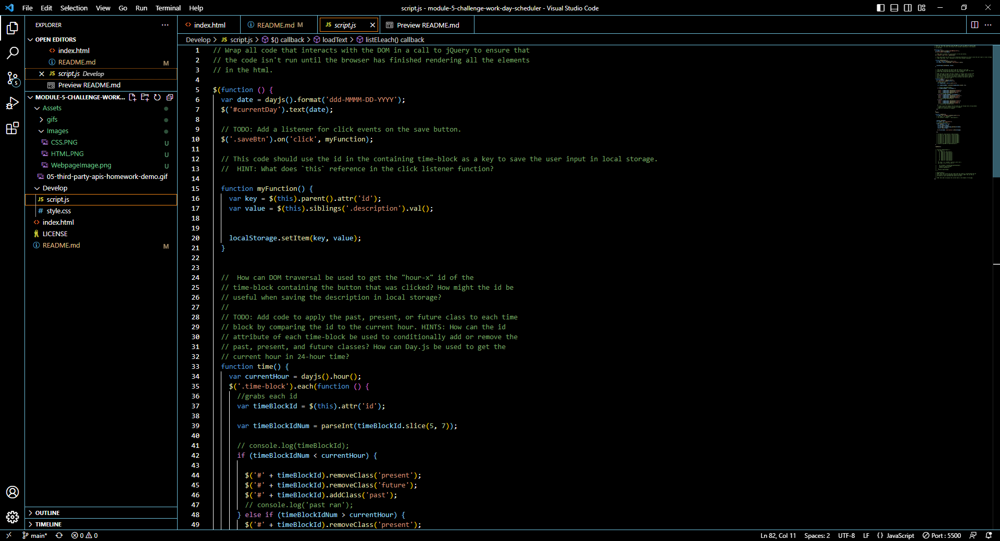

# Module 05 Challenge Work Day Scheduler
## -->[Link to the Deployed page](https://thvt1guy.github.io/module-5-challenge-work-day-scheduler/)<--

## Starter Code Provided
- Enter desired note into text field
- Click save button to save text
- When saved text will remain in texa area even when refreshing the page
- Text area will be grey if time has been passed
- Text area will be red for current time 
- Text area will be green for upcoming events
- 9-5 workday planned

## WEBSITE PAGE GIF

## HTML FILE IMAGE

## CSS FILE IMAGE

## JavaScript FILE IMAGE

